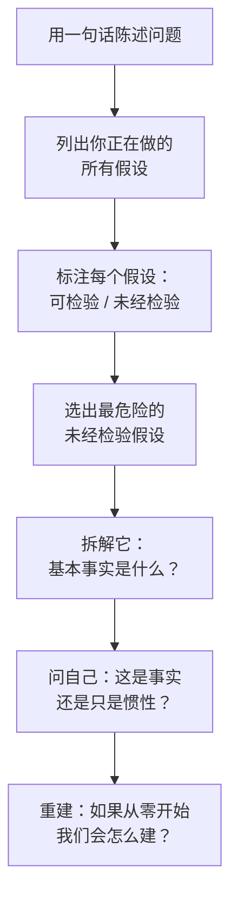

# 🧠 第一性原理思维（First-Principles Thinking）

> **把第一性原理从"哲学口号"变成可执行、可重复的结构化工作流。**
>
> First-principles thinking, as an executable workflow — not a philosophy slogan.

[](LICENSE)
[]()

---

## 这是什么？

一套**五阶段结构化方法论**，引导你（或你的 AI Agent）将复杂问题拆解到不可约的基本真理，区分物理约束与组织惯性，从地基开始重建全新方案。

这不是一篇"像马斯克一样思考"的博文。这是一个**可执行的技能（Skill）**——一套包含模板、检查清单、决策规则和案例研究的可重复工作流，专为 AI 编程 Agent 设计。

### 什么时候用？

| ✅ 适合使用 | ❌ 不适合使用 |
|------------|-------------|
| 问题新颖、复杂，现有方案效果不佳 | 问题常规，行业标准方案已足够好 |
| 你怀疑继承的假设掩盖了更好的选择 | 速度比最优解更重要 |
| 值得投入认知成本做深度拆解 | 你缺乏领域知识去验证基本事实 |
| 你需要突破性想法，而非渐进式改进 | 类比或最佳实践就够用了 |

---

## 五阶段工作流


| 阶段 | 目标 | 关键产出 |
|------|------|---------|
| **一、暴露并挑战假设** | 把所有隐藏的默认前提摆到台面上 | 假设清单，标注 T（可检验）/ U（未经检验） |
| **二、原子化拆解** | 沿六个维度拆解到不可约的基本事实 | 约束矩阵（物理、经济、信息、人性、组织、监管） |
| **三、事实 vs 惯性** | 区分不可撼动的约束和可以改变的历史 | 双栏账本：不可变事实 ↔ 可移动惯性 |
| **四、从地基重建** | 仅以不可变事实为脚手架，构建新方案 | 基于流的最小可行架构 |
| **五、实验验证** | 把假设变成经过检验的知识 | 实验卡片（含失败信号和转向预案） |

### 八个核心诊断问题（快速版）

1. 我们在解决的**终极问题**到底是什么？
2. 哪些约束是**物理上、法律上、数学上不可改变的**？
3. 哪些约束**只是习惯、历史包袱或组织伤疤**？
4. 如果今天从零开始，**我们会怎么建**？
5. 能交付价值的**最小闭环**是什么？
6. **最大的成本、延迟和风险**来自哪里？
7. 哪些模块**必须自研**，哪些可以**外购**，哪些**根本不需要**？
8. 验证这个设计的**最快实验**是什么？

---

## 在不同 AI Agent 中使用

### 🔵 Codex（OpenAI Codex CLI）

**方法一：安装为 Skill（推荐）**

将整个 `first-principles-thinking/` 文件夹复制到 Codex 技能目录：

```powershell
# Windows (PowerShell)
Copy-Item -Recurse .\first-principles-thinking\ "$env:USERPROFILE\.codex\skills\first-principles-thinking\"
```

```bash
# macOS / Linux
cp -r ./first-principles-thinking/ ~/.codex/skills/first-principles-thinking/
```

安装后在 Codex 对话中自然触发：

```
用第一性原理分析：为什么我们的LLM评估流程需要3轮人工审核？
```

```
从第一性原理出发，拆解我们微服务架构的合理性。
```

**方法二：作为上下文文件**

把 `SKILL.md` 放入项目目录，Codex 会按 `AGENTS.md` 约定自动发现。

---

### 🟠 Claude Code（Anthropic）

**方法一：追加到 CLAUDE.md**

```bash
cat first-principles-thinking/SKILL.md >> CLAUDE.md
```

然后对话中触发：

```
用第一性原理分析：我们应该自建向量数据库还是直接用Pinecone？
```

**方法二：上传为项目知识**

在 Claude Code 中用 `/init` 创建项目，将 `SKILL.md` 和 `references/` 文件夹添加为项目知识文件。Claude 会在你调用第一性原理分析时自动引用。

**方法三：自定义斜杠命令**

在 `.claude/commands/first-principles.md` 中创建：

```markdown
你现在进入第一性原理思维模式。严格按照五阶段工作流执行：

1. 暴露所有假设，标注 T（可检验）/ U（未经检验）
2. 对 U 类假设，沿六个约束维度进行原子化拆解
3. 制作"事实 vs 惯性"双栏账本
4. 从地基开始，基于流设计重建方案
5. 定义验证实验，明确失败信号和转向预案

完整方法论参见 SKILL.md。
```

---

### 🟣 WorkBuddy / 通用 AI Agent

WorkBuddy 及类似 Agent 支持自定义指令文件。

**方案 A：工作区指令**

将 `SKILL.md` 放在项目根目录，启动会话时告诉 Agent：

```
加载 SKILL.md，对当前问题应用第一性原理思维工作流。
```

**方案 B：提示词模板**

对话开始时粘贴[八个核心诊断问题](#八个核心诊断问题快速版)。完整会话可直接将整份 `SKILL.md` 作为系统上下文。

**方案 C：Custom GPT / ChatGPT**

创建一个 Custom GPT，将 `SKILL.md` 设为系统提示词。`references/` 中的模板和案例可作为知识文件上传，获得更丰富的回复。

---

## 五分钟快速上手



**30 秒示例：**

> **问题：** "我们的部署流程需要 3 天。"
>
> **假设审查：** "需要 QA 签字" → 未经检验。"服务器是物理机" → 可检验 → 成立。
>
> **原子化拆解：** QA 签字占了 3 天中的 2.5 天。QA 实际在测什么？80% 是回归检查，CI 已经覆盖了。
>
> **重建：** CI 通过的改动自动部署到 staging。QA 只审查净新增行为。部署：3 天 → 4 小时。

---

## 包含的案例研究

`references/case-studies.md` 包含四个完整注释案例：

| 案例 | 领域 | 核心洞察 |
|------|------|---------|
| **SpaceX：火箭为什么贵？** | 航空航天 / 制造 | 燃料成本仅占 0.3%。贵的是组织，不是物理。 |
| **Tesla：电池为什么贵？** | 能源 / 汽车 | 原材料 ~$80/kWh，市场价 $600/kWh。规模化 + 垂直整合。 |
| **软件架构：微服务 vs 单体** | 软件工程 | 挑战流行驱动的架构选择。只在复杂度成本可度量时才拆分。 |
| **供应链：跨境制造** | 运营 / 物流 | 公司在优化单价，但真正的成本是库存持有 + 报废。 |

---

## 文件结构

```
first-principles-thinking/
├── README.md                          ← 你在这里
├── SKILL.md                           ← 完整方法论（五阶段、决策规则、输出格式）
├── LICENSE                            ← MIT
├── references/
│   ├── templates.md                   ← 6 张可复用工作表
│   └── case-studies.md                ← 4 组注释案例 + 模式总结
└── .codex-plugin/
    └── plugin.json                    ← Codex 插件清单（一键安装）
```

---

## 安装（全平台）

### 作为 Codex 插件

```bash
# 从本地文件夹安装
codex plugin install ./first-principles-thinking

# 或通过市场安装（即将上线）
codex plugin install first-principles-thinking
```

### 作为独立文件

直接 clone 使用。零依赖，零构建——纯 Markdown。

```bash
git clone https://github.com/RavenlionX/first-principles-thinking.git
```

---

## 常见陷阱

| 陷阱 | 对策 |
|------|------|
| **把观点当事实** | "用户不会接受"未经检验。去检验它。 |
| **拆解停不下来** | 到可验证就停。不要原子化到哲学层面。 |
| **只拆不建** | 拆解而不重建只是批评，不是思考。 |
| **忽略执行成本** | 一个完美但需要 10 年才能建成的方案仍然是错的。 |
| **拒绝一切类比** | 有些惯例存在是因为它们确实最优。只挑战通不过"事实/惯性"检验的。 |

---

## 相关技能

以下技能可组合为"决策工具箱"：

- **贝叶斯决策技能** — 先验→证据→后验→行动阈值，含敏感性分析
- **博弈论分析技能** — 竞争、谈判、战略互动分析
- **主要矛盾分析技能** — 识别复杂局面中的主要矛盾和突破口

---

## 作者

**RavenlionX** — AI 研究员，国防领域。为 AI Agent 时代构建结构化思维工具。

---

## 许可证

MIT © RavenlionX — 随意使用、Fork、发布。署名即感激。
