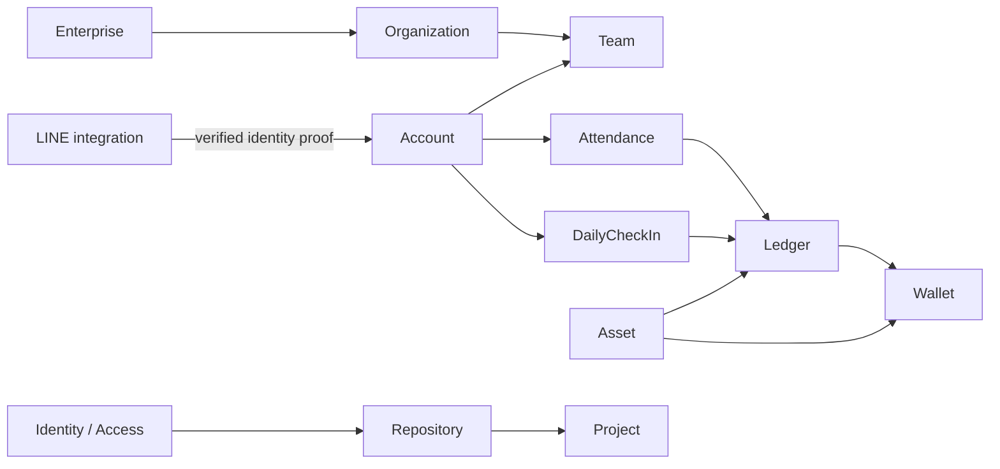

# Repository map

本頁回答四個問題：誰負責、真相在哪、誰可以依賴誰、怎麼證明沒壞。Owner-local business semantics 回 [Domain owners](../010-domain-owners/README.md)。

## Boundary model

| Boundary | Authority |
| --- | --- |
| Bounded Context | model + language + business authority |
| Module Boundary | source responsibility + public surface |
| Data Boundary | persisted facts + access/isolation |
| Consistency Boundary | must-be-atomic invariants |
| Trust Boundary | 外部輸入何處開始不可信 |
| Runtime Boundary | execution lifecycle / provider environment |

Shared transaction、同名 package 或同一 database 都不能自動合併這些 boundary。

## Current relationship shape

箭頭表示 consumer 需要 owner capability，不表示 permission inheritance、private-model sharing 或 deep import。



精確 relationship、contract、capability、invariant 與 implementation mapping 以 `architecture/semantic-model.json` 為準。

## Integration semantics

先問 consumer 真正需要什麼，再選最小充分 contract：

| Need | Default form |
| --- | --- |
| 只需指向另一 owner 的 subject | Stable ID / reference |
| 需要當下 owner decision | Query / capability contract |
| 要求 owner 執行行為 | Command |
| 已 commit fact 有真實 asynchronous consumer | Event |
| 只為 read/navigation | Projection |
| External/upstream model 會污染 local language | Adapter translation / ACL |

Port = consumer/application 需要的 capability，不是 provider SDK API wrapper。

## Source of Truth registry

| 問題 | Authoritative source |
| --- | --- |
| Cross-context semantics / owner / capability / invariant / locator | `architecture/semantic-model.json` |
| External GitHub-like benchmark | `architecture/semantic-benchmark.json` + pinned upstream source |
| Module mapping / allowed workspace dependency | `architecture/implementation-topology.json` |
| Data owner / relation role / schema-file mapping | `architecture/data-topology.json` |
| Actual DB structure / constraint / RLS | `supabase/schemas/` |
| Owner-local business semantics | `docs/010-domain-owners/*` + owner source/tests |
| Public package surface | each `package.json#exports` |
| Runtime behavior | actual source + tests |
| Repository command surface | root `package.json#scripts` |
| Repeatable operations | `scripts/` |
| GitHub platform integration | `.github/` |
| Scoped agent constraints | root + nearest `AGENTS.md` |
| Target / migration / gap / risk / dated acceptance | `docs/090-governance/` |
| Remote/deployment/provider/device truth | dated provider/API/device readback |

Human docs只解釋 meaning / why / routing，不複製 machine facts。

## Implementation mapping

```text
Semantic owner
↓ explicit mapping
Module Boundary
↓ public contract
Consumer

Persisted fact
↓ explicit mapping
Data Boundary
↓
supabase/schemas
```

查 mapping 使用 [Architecture](../../architecture/README.md) 的 `pnpm semantic explain`、`pnpm semantic plan`、`pnpm boundaries` 與 schema commands；不要從 folder name猜。

## Stop rule

當任務已唯一定位：

```text
Owner
+ Truth
+ Boundary
+ Invariant
+ Validation
```

就停止擴張閱讀面。
