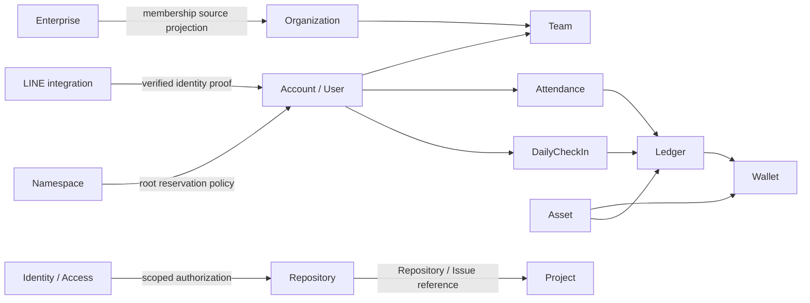

# Repository map

本文件保存 current 跨 owner relationship、boundary mapping 與 Source-of-Truth routing；Strategic relationship / integration / mapping 的概念定義由 [Strategic design](070-strategic-design/README.md) 擁有。Owner-local business semantics 回到對應 [Domain owner](../010-domain-owners/README.md)。

## Strategic-to-implementation chain

```text
Context Responsibility / Ownership
      ↓
Context Map
      ↓
Upstream / Downstream
      ↓
Integration Pattern
      ↓
Integration Semantics
├─ Stable ID
├─ Snapshot
├─ Query
├─ Command
└─ Event
      ↓
Business Invariant / Policy Ownership
      ↓
Consistency Boundary
      ↓
────────────────────────
Implementation Mapping
├─ Module Boundary
├─ Data Boundary
└─ Public Contract
      ↓
Hexagonal Architecture
```

概念定義見 [Context relationships](070-strategic-design/040-context-relationships.md)、[Integration semantics](070-strategic-design/050-integration-semantics.md)、[Invariant / consistency](070-strategic-design/060-invariants-policy-consistency.md) 與 [Implementation mapping](070-strategic-design/070-implementation-mapping.md)。

## Current context map

箭頭表示 dependency / contract，不表示 permission inheritance、shared private model 或可以 deep import。



Selected future 的 Workforce → Attendance → Payroll → Finance 關係只由 Governance 維護，未完成前不以本圖宣稱 current。

## Current relationships

| Upstream / policy owner | Consumer | Consumer needs | Current semantic form | 不可推論 |
| --- | --- | --- | --- | --- |
| Namespace | Account / User | global root reservation / collision policy before accepting login | Query / policy contract | reserved key != identity / authorization |
| LINE integration | Account / User | verified LINE identity proof for mapping / qualification | External proof | provider identity proof != User qualification / business authorization |
| Enterprise | Organization | active Enterprise Team membership + Team-to-Organization assignment | Projection | Enterprise membership source != Organization authority |
| Account / User | Team | current User qualification + participation identity | Stable ID + Query | active User != Team member / TeamMaintainer |
| Account / User | Attendance | qualified User / current subject | Stable ID + Query | active User != 任意 Workplace 可打卡 |
| Account / User | DailyCheckIn | User identity / qualification | Stable ID + transaction-time Query | pre-check 不取代 transaction recheck |
| Organization | Team | Organization scope / participation | Stable ID + Query | Organization 不直接寫 TeamMembership |
| DailyCheckIn | Ledger | authorized reward decision | Command / committed fact within required transaction semantics | Ledger 不取得 Account lifecycle authority |
| Attendance | Ledger | authorized clock reward decision | Command / committed fact within required transaction semantics | Ledger posting != Payroll / 工時核定 |
| Asset | Wallet | AssetCode / denomination | Stable ID + Query | Asset 存在 != holder eligibility |
| Asset | Ledger | AssetCode / denomination | Stable ID + Query | Asset 存在 != posting authorization |
| Ledger | Wallet | immutable value facts | Projection input | Wallet 不保存第二份 writable balance |
| Identity / Access | Repository | scoped feature authorization decision composed with Repository policy | Query / decision contract | feature permission != Repository ownership / content authority |
| Repository | Project | Repository identity reference | Reference | Project reference != Repository authority |
| Repository | Project | Repository-owned Issue reference | Reference | Project metadata != Issue lifecycle / state authority |

Relationship 尚未正式選定 ACL / Conformist / Customer-Supplier 等 pattern 時，不從 import direction 猜；pattern decision rule 見 [Context relationships](070-strategic-design/040-context-relationships.md)。

## Boundary model

四種邊界必須分開：

| Boundary | 問題 |
| --- | --- |
| Bounded Context | 哪套 model / language / business authority 在哪裡有效？ |
| Module Boundary | 哪個 source owner / public surface 負責實作？ |
| Data Boundary | 哪些 persisted facts / access / isolation 由誰擁有？ |
| Consistency Boundary | 哪些 invariant 必須在同一 atomic transition 成立？ |

Shared DB transaction 不等於合併 Bounded Context；同名 package/table 也不能反向證明 Context。

## Current implementation projection

Cross-context structured semantics 以 `architecture/semantic-model.json` 為準；implementation topology 以 `architecture/implementation-topology.json` 為準；schema surface ownership / Data Boundary mapping 以 `architecture/data-topology.json` 為準；database structure current state 以 `supabase/schemas/` 為準。下表只做 human-readable routing，不覆寫 machine truth。

| Business owner | Module Boundary | Data / persistence responsibility | Public contract |
| --- | --- | --- | --- |
| Account | `packages/account` | Account / User identity facts | package exports |
| Enterprise | `packages/enterprise` | Enterprise governance facts | package exports |
| Organization | `packages/organization` | Organization governance facts | package exports |
| Workforce | `packages/workforce` | target Employment / terms / schedule responsibility；runtime persistence 尚未啟用 | 目前無 public export |
| Team | `packages/team` | Organization-scoped Team facts | package exports |
| Repository | `packages/repository` | Repository identity/access + Issue/Discussion lifecycle facts | package exports |
| Project | `packages/project` | Project data authority 已存在；runtime capability 尚未啟用 | 目前無 public export |
| Namespace | `packages/namespace` | shared cross-owner namespace policy；目前不擁有獨立 persistence | `@line-work/namespace/root` |
| Attendance | `packages/attendance` | Attendance / Workplace facts | package exports |
| Payroll | `packages/payroll` | current readiness foundation; formal result persistence remains gated | package exports |
| Asset | `packages/asset` | value definition / denomination | package exports |
| Wallet | `packages/wallet` | holding / derived balance projection facts | package exports |
| Ledger | `packages/ledger` | append-only value facts | package exports |
| DailyCheckIn | `packages/daily-check-in` | daily check-in / command evidence | package exports |
| Identity / Access | `packages/identity-access` | authorization-related persisted facts where applicable | package exports |
| LINE / Google | integration packages | provider mapping/config only; not business authority | integration exports |

Workforce、Project 與 Namespace 已有明確 workspace/module boundary，但 module existence 不等於所有 capability 已完成。Namespace 目前只有 global-root reservation policy 是 executable；更廣泛的 claim / resolve / rename capability 仍需以真實 consumer、source、public exports、consistency boundary 與 validation evidence 判斷。

## Source of truth

| 問題 | Authoritative source |
| --- | --- |
| Cross-context structured semantic architecture | `architecture/semantic-model.json` |
| Strategic concept / decision rules | `docs/000-core/070-strategic-design/` |
| Product / cross-context current meaning | `docs/000-core/020-domain-map.md` / 本頁 |
| Owner-local business semantics | `docs/010-domain-owners/*` |
| Runtime behavior | actual source code + tests |
| Implementation topology / allowed workspace dependency | `architecture/implementation-topology.json` + executable architecture guards |
| Data topology / schema surface ownership | `architecture/data-topology.json` + `supabase/schemas/` + executable architecture guards |
| Public package surface | each `package.json#exports` |
| Database current structure | `supabase/schemas/` |
| Repository command surface | root `package.json#scripts` |
| Repeatable operation implementation | `scripts/` |
| GitHub integration | `.github/` |
| Scoped agent constraints | root + nearest `AGENTS.md` |
| Decision / active proposal / active migration / gap / risk / retained dated evidence | `docs/090-governance/` |
| Remote / deployment / device truth | provider/API/device readback with dated evidence |

當 docs 與 code 衝突，先判斷文件過期或 implementation 違反 canonical contract；不要直接假設其中一方正確。

Implementation layering 接 [Hexagonal architecture](../020-architecture/020-hexagonal-architecture.md)；Data ownership 細節接 [Data boundary model](../040-data/010-data-boundary-model.md)。
