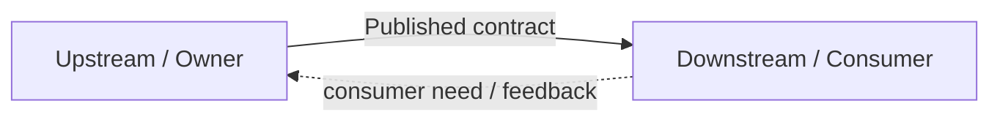

# Context relationships

## Canonical responsibility

本文件定義 **Context Map、Upstream / Downstream、Integration Patterns** 的 strategic semantics。Current relationship inventory 只由 [Repository map](../030-repository-map.md) 維護。

## Context Map

Context Map 描述不同 Bounded Context 之間的：

```text
Model relationship
+
Ownership relationship
+
Integration relationship
```

它不是 service topology 圖，也不是 package dependency graph。

Current map 應回答：

- Provider / Upstream 是誰？
- Consumer / Downstream 是誰？
- Upstream 擁有什麼 truth？
- Downstream 真正需要什麼？
- 使用什麼 contract？
- 選用哪種 integration pattern？
- 哪些推論明確禁止？

## Upstream / Downstream

- **Upstream**：提供 owner-approved model、decision、fact 或 contract 的一方。
- **Downstream**：消費該能力並承受 contract 變化的一方。

Upstream / Downstream 不等於 HTTP caller / callee。某個 request 的呼叫方向可能和 strategic dependency direction 不同。



## Integration pattern decision

八種 pattern 是 relationship decision language，不是 checklist；沒有真實 relationship 就不選 pattern。

| Pattern | 核心語意 | 適用條件 | 主要風險 |
| --- | --- | --- | --- |
| Anti-Corruption Layer (ACL) | 翻譯外部 / upstream model，保護 local language | 上游語意會污染 local Domain | translation responsibility |
| Customer / Supplier | Supplier 明確服務 downstream Customer 的需求 | 有穩定上下游與協調機制 | contract negotiation cost |
| Conformist | Downstream 接受 upstream language/model | local differentiation 低、翻譯不值得 | 高 upstream coupling |
| Partnership | 雙方共同演進、共同成功 | 變更必須密切協作 | coordination cost 高 |
| Shared Kernel | 受控共享極小模型 | 真正需要 shared semantic core | shared surface 擴張 |
| Separate Ways | 不整合 | integration 成本高於價值 | duplication / non-interoperability |
| Open Host Service | Upstream 提供標準化 service surface 給多個 consumer | consumer 數量與 contract stability 已成立 | public surface 維護成本 |
| Published Language | 提供穩定可版本化的跨邊界語言 | API / event / message 需要共同 schema | external contract evolution |

## Pattern boundaries

### ACL

ACL 不是「所有 adapter 都叫 ACL」。只有當 translation 的責任是保護 local Domain language 時才成立。

典型位置：

```text
External / Upstream model
↓
Adapter / ACL
↓
Local canonical model
```

### Shared Kernel

Shared Kernel 是例外，不是重用預設。共享前必須能回答：

- 為什麼 duplicate model 比 shared model 更危險？
- 誰能修改 shared kernel？
- 兩個 Context 是否接受一起 release / review？

只因兩邊 type 長得一樣，不足以共享。

### Open Host Service / Published Language

兩者常搭配但不是同一概念：

```text
Open Host Service
= 穩定 capability surface

Published Language
= surface 使用的穩定 shared language
```

## Current relationship source

本文件不列第二份 current relationship table。實際 current Provider → Consumer → Contract → 禁止推論，只看 [Repository map](../030-repository-map.md)。

若某 relationship 的 pattern 尚未明示，不要僅因 import direction 自行宣稱 ACL、Conformist 或 Customer/Supplier。
