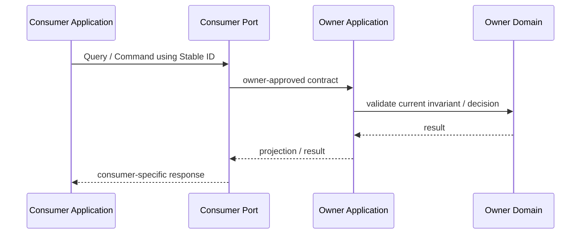

# Integration semantics

## Canonical responsibility

本文件定義跨 Context 應該「傳什麼語意」：**Stable ID、Snapshot、Query、Command、Event**，以及 Port / Contract ownership。Current relationship 使用哪一種，回 [Repository map](../030-repository-map.md)。

## Minimum-sufficient order

跨 boundary 不先問「要不要 event bus」，而先問 consumer 最少需要什麼。

```text
Stable ID
↓
Snapshot
↓
Query
↓
Command
↓
Event
```

這不是成熟度 ranking；只有需求增加時才往下選更重的 semantic。

## Stable ID

Stable ID 只定位 owner 的 concept。

適合：

- consumer 只需要 reference；
- current detail 可由 owner 查；
- 不需要複製 owner model。

Invariant：

```text
ID
≠ authorization
≠ ownership
≠ snapshot
```

## Snapshot

Snapshot 是某個時間點的 historical observation。

適合：

- 歷史結果需要能重建；
- upstream 後來改變，不應改寫既有 downstream result；
- consumer 必須保存「當時看見什麼」。

Snapshot 不得成為第二個 writable authority。

```text
Snapshot
= observed historical fact

不是
= copied owner
```

## Query

Query 用於取得 owner 的 current fact / decision。

適合：

- current state 很重要；
- consumer 不應保存 authority；
- 即時 dependency 的成本可接受。

Query failure 必須保留 not-found、forbidden、unavailable、conflict 等必要語意，不能全部壓成 null / empty。

## Command

Command 表示：

```text
Do X
```

Consumer 要求 owner 執行行為；owner 必須重新驗證 current authorization、scope、version、replay 與 invariant。Caller 曾經通過 pre-check 不取代 command-time validation。

## Event

Event 表示：

```text
X happened
```

只有同時成立才建立：

1. business fact 已 committed；
2. event 有明確 owner；
3. 存在真實 consumer；
4. delivery/replay semantics 有必要；
5. payload 可保持 stable、最小、不洩漏 private aggregate。

沒有 consumer 就不為「未來可能」預建 event。

Domain Event、Integration Event、Audit row、Outbox row、Provider webhook 不自動 1:1。

## Semantic sequence



若需要跨 process delivery，owner commit business fact 後才把它 translation 成 versioned Integration Event。

## Contract ownership

```text
Consumer need
↓
Application Port
↑
Adapter implementation
```

- Consumer 擁有自己需要的 Port。
- Provider / Domain owner 擁有自己的 truth 與 published capability。
- Adapter 擁有 translation / provider protocol。
- Public Contract 不是 private Entity serialization。
- Port 以 capability 命名，不以 Supabase / Redis / LINE SDK API 命名。

詳細 implementation handoff 見 [Strategic to Hexagonal](080-strategic-to-hexagonal.md)。
