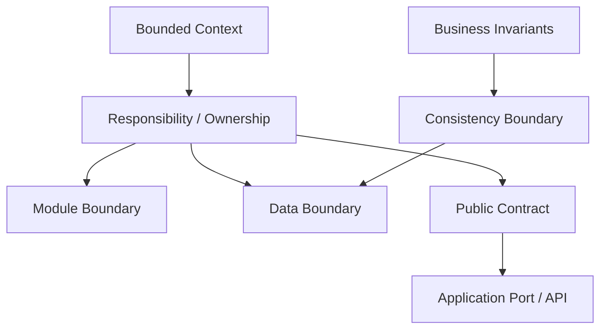

# Implementation mapping

## Canonical responsibility

本文件定義 Strategic DDD 如何投影成 **Module Boundary、Data Boundary、Public Contract**。Current mapping inventory 由 [Repository map](../030-repository-map.md) 解釋；machine truth 仍分別由 manifest、package exports、schema 擁有。

## Four boundaries

```text
Bounded Context
= model + language + business authority

Module Boundary
= source responsibility + public/private surface

Data Boundary
= persisted facts + access + isolation authority

Consistency Boundary
= invariants requiring atomic consistency
```

因此：

```text
Bounded Context
≠ Module Boundary
≠ Data Boundary
≠ Consistency Boundary
```

它們可以對齊，但對齊必須是責任推導結果，不是 naming convention。

## Module Boundary

Module Boundary 回答：

- 這段 source responsibility 放哪？
- public surface 是什麼？
- consumer 能依賴什麼？
- private implementation 在哪裡停止？

Current machine topology 的 authority 是 [architecture/implementation-topology.json](../../../architecture/implementation-topology.json)；cross-package consumer 只走 package public exports。

不要由 Bounded Context 名稱直接推導「必須新建 package」。現有 package 能承擔且 boundary 清楚時，優先 reuse。

## Data Boundary

Data Boundary 回答：

- 哪些 persisted facts 是 owner 的 authority？
- 誰可 read / mutate？
- isolation scope 是什麼？
- 哪些 constraints / RLS / grants / transaction 保護它？

Current database structure 的 authority 是 [supabase/schemas](../../../supabase/schemas/)；詳細原則見 [Data boundary model](../../040-data/010-data-boundary-model.md)。

Schema 應按 Data Owner 與 dependency order 理解，不從 TypeScript package 名稱機械複製。

## Public Contract

Public Contract 是 consumer 可合法依賴的能力／資料語言。

它可以是：

- package export
- Application Port
- query / command contract
- versioned event / Published Language
- owner-approved projection

它不應是：

- private Entity / Aggregate graph
- private database row
- adapter client
- dist / testing path
- provider SDK surface 重新包一層就叫 Domain contract

## Mapping flow



## Source-of-truth routing

| Mapping question | Authority |
| --- | --- |
| Strategic meaning | [Domain map](../020-domain-map.md) + owner docs |
| Context relationship | [Repository map](../030-repository-map.md) |
| Package topology | `architecture/implementation-topology.json` |
| Public package surface | each `package.json#exports` |
| Data current state | `supabase/schemas/` |
| Dependency enforcement | architecture guards / tests |
| Future mapping | Governance proposal / migration |
| Remote truth | provider / database readback |

## ERD rule

ERD 只描述 Data Boundary / persistence relationship。它不能用 foreign key 自動推導 Bounded Context、ownership 或 business lifecycle。若新增 ERD，必須和 schema owner 同步，不能成為第二套 schema truth。
